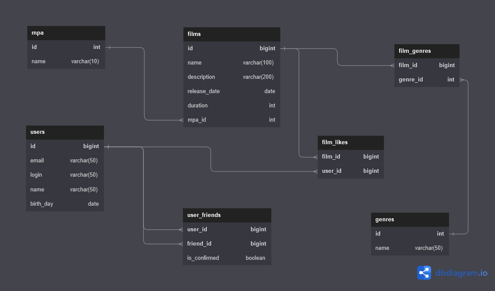

# Репозиторий для проекта Filmorate

### <a href="Ревью от MSmirnov2407 для IgorAtafev.txt">Ревью от MSmirnov2407 для IgorAtafev</a>

### Диаграмма БД

  
  
------ 
### Описание БД

**Таблица films**  
Информация о фильмах:  
  
    id — идентификатор (первичный ключ);
    name — название фильма;
    description — описание фильма;
    release_date — дата релиза;
    duration — продолжительность фильма;
    mpa_id — идентификатор рейтинга MPA (внешний ключ - отсылает к таблице mpa);

**Таблица mpa**  
Информация о рейтингах Ассоциации кинокомпаний (MPA):

    id — идентификатор (первичный ключ);
    name — название рейтинга;

**Таблица genres**  
Информация о жанрах фильмов:

    id — идентификатор (первичный ключ);
    name — название жанра;

**Таблица film_genres**  
Связь фильма с жанрами:

    film_id — идентификатор фильма (первичный ключ, внешний ключ - отсылает к таблице films);
    genre_id — идентификатор жанра (первичный ключ, внешний ключ - отсылает к таблице genres);
 
**Таблица users**  
Информация о пользователях: 
  
    id — идентификатор (первичный ключ);
    email — электронная почта;
    login — логин пользователя;
    name — имя пользователя;
    birth_day — дата рождения; 

**Таблица user_friends**  
Друзья пользователя: 
  
    user_id — идентификатор пользователя (первичный ключ, внешний ключ - отсылает к таблице users);
    friend_id — идентификатор пользователя (первичный ключ, внешний ключ - отсылает к таблице users);

**Таблица film_likes**  
Лайки фильмов: 
  
    film_id — идентификатор фильма (первичный ключ, внешний ключ - отсылает к таблице films);
    user_id — идентификатор пользователя (первичный ключ, внешний ключ - отсылает к таблице users);

**Таблица director**
Информация о режиссёре:

    director_id — идентификатор (первичный ключ);
    name — имя режиссёра;

**Таблица film_director**  
Режиссёры фильмов:

    film_id — идентификатор фильма (первичный ключ, внешний ключ - отсылает к таблице films);
    director_id — идентификатор режиссёра (первичный ключ, внешний ключ - отсылает к таблице director);

**Таблица events**
Летна событий:
    
    event_id — идентификатор (первичный ключ);
    timestamp — время события;
    user_id — идентификатор пользователя (первичный ключ, внешний ключ - отсылает к таблице users);
    event_type — идентификатор типа события (первичный ключ, внешний ключ - отсылает к таблице event_type);
    operation — идентификатор операции (первичный ключ, внешний ключ - отсылает к таблице operation);
    entity_id — идентификатор сущности, с которой произошло событие;

**Таблица event_type**
Типы событий:
    
    id — идентификатор (первичный ключ);
    event_type_name — тип события (LIKE, REVIEW или FRIEND);

**Таблица operation**
Операции:

    id — идентификатор (первичный ключ);
    operation_name — операция (REMOVE, ADD, UPDATE);

**Таблица reviews**
Информация об отзыве:

    id — идентификатор (первичный ключ);
    content — содержание отзыва;
    is_positive — тип отзыва (негативный/положительный);
    film_id — идентификатор фильма (первичный ключ, внешний ключ - отсылает к таблице films);
    user_id — идентификатор пользователя (первичный ключ, внешний ключ - отсылает к таблице users);
    useful — рейтинг отзыва;

**Таблица review_likes**
Лайки отзывов:
    
    review_id — идентификатор отзыва (первичный ключ, внешний ключ - отсылает к таблице reviews);
    user_id — идентификатор пользвателя (первичный ключ, внешний ключ - отсылает к таблице users);
    is_useful — оценка отзыва (полезно/бесполезно);

------ 

### Примеры запросов  
**Все фильмы**
```roomsql
SELECT *
FROM films;
```

**Фильм по id**
```roomsql
SELECT *
FROM films
WHERE id = 1;
```

**Все пользователи**
```roomsql
SELECT *
FROM users;
```

**Пользователь по id**
```roomsql
SELECT *
FROM users
WHERE id = 1;
```

**Все режиссёры**
```roomsql
SELECT *
FROM director;
```

**Режиссёры по id**
```roomsql
SELECT *
FROM director
WHERE director_id = 1;
```

**Друзья пользователя (вариант с JOIN)**
```roomsql
SELECT u.*
FROM users u
INNER JOIN user_friends uf ON uf.friend_id = u.id
WHERE uf.user_id = 1;
```

**Друзья пользователя (вариант с подзапросом)**
```roomsql
SELECT *
FROM users
WHERE id IN (SELECT friend_id
             FROM user_friends
             WHERE user_id = 1);
```

**Общие друзья пользователей (вариант с JOIN)**
```roomsql
SELECT u.*
FROM users u
INNER JOIN user_friends uf ON uf.friend_id = u.id
INNER JOIN user_friends ufc ON ufc.friend_id = uf.friend_id
WHERE uf.user_id = 1 AND ufc.user_id = 2;
```

**Общие друзья пользователей (вариант с подзапросом)**
```roomsql
SELECT *
FROM users
WHERE id IN (SELECT friend_id
             FROM user_friends
             WHERE user_id = 1 AND friend_id IN (SELECT friend_id
                                                 FROM user_friends
                                                 WHERE user_id = 2));
```

**10 наиболее популярных фильмов по количеству лайков**
```roomsql
SELECT f.*,
       COUNT(fl.user_id) count_of_likes
FROM films f
LEFT JOIN film_likes fl ON fl.film_id = f.id
GROUP BY f.id
ORDER BY count_of_likes DESC
LIMIT 10;
```

**Режиссёры фильма**
```roomsql
SELECT d.* 
FROM director AS d 
RIGHT JOIN film_director fd ON d.director_id = fd.director_id 
WHERE film_id = 1 ORDER BY director_id
```

**Все фильмы режиссёра, отсортированных по годам**
```roomsql
SELECT DISTINCT f.*, m.name mpa_name
FROM film_director fd 
LEFT JOIN films f ON f.id = fd.film_id 
INNER JOIN mpa m ON m.id = f.mpa_id 
WHERE fd.director_ID = 1
ORDER BY EXTRACT(YEAR FROM f.release_date)
```

**Все фильмы режиссёра, отсортированных по количеству лайков**
```roomsql
SELECT DISTINCT f.*, m.name mpa_name
FROM film_director fd 
LEFT JOIN films f ON f.id = fd.film_id 
INNER JOIN mpa m ON m.id = f.mpa_id 
LEFT JOIN film_likes fl ON fl.film_id =f.id 
WHERE fd.director_ID = 1 
GROUP BY f.id 
ORDER BY COUNT(f.id)
```

**Поиск фильмов по названию**
```roomsql
SELECT f.*, m.name mpa_name FROM films f 
INNER JOIN mpa m ON m.id = f.mpa_id 
LEFT JOIN film_likes fl ON fl.film_id = f.id 
WHERE lower(f.name) LIKE lower('%крад%')
GROUP BY f.id
ORDER BY COUNT(fl.film_id) DESC, f.id ASC
```

**Поиск фильмов по режиссёру**
```roomsql
SELECT f.*, m.name mpa_name FROM films f 
INNER JOIN mpa m ON m.id = f.mpa_id 
LEFT JOIN film_likes fl ON fl.film_id = f.id 
INNER JOIN film_director df ON f.id = df.film_id 
INNER JOIN director d ON d.director_id = df.director_id 
WHERE lower(d.name) LIKE lower('%крад%')
GROUP BY f.id
ORDER BY COUNT(fl.film_id) DESC, f.id ASC
```

**Поиск фильмов по названию и режиссёру**
```roomsql
SELECT f.*, m.name mpa_name FROM films f
INNER JOIN mpa m ON m.id = f.mpa_id 
LEFT JOIN film_likes fl ON fl.film_id = f.id 
LEFT JOIN film_director df ON f.id = df.film_id 
LEFT JOIN director d ON d.director_id = df.director_id
WHERE lower(d.name) LIKE lower('%крад%') OR lower(f.name) LIKE lower('%крад%')
GROUP BY f.id
ORDER BY COUNT(fl.film_id) DESC, f.id ASC
```