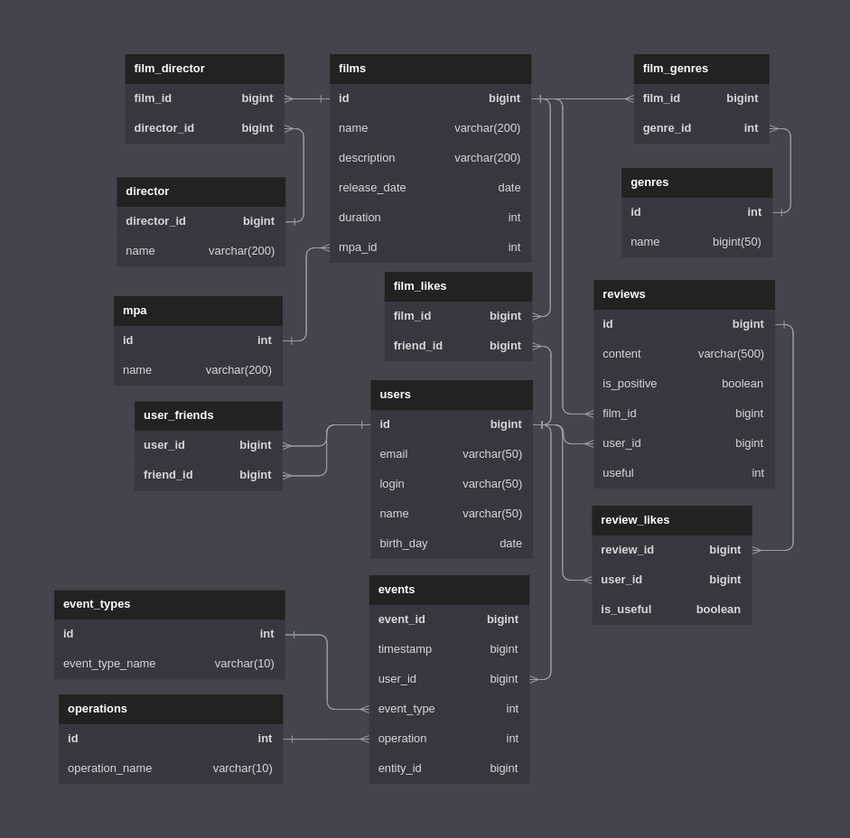

# Репозиторий для проекта Filmorate

### <a href="Ревью от MSmirnov2407 для IgorAtafev.txt">Ревью от MSmirnov2407 для IgorAtafev</a>

### Диаграмма БД

  
  
------ 
### Описание БД

**Таблица films**  
Информация о фильмах:  
  
    id — идентификатор (первичный ключ);
    name — название фильма;
    description — описание фильма;
    release_date — дата релиза;
    duration — продолжительность фильма;
    mpa_id — идентификатор рейтинга MPA (внешний ключ - отсылает к таблице mpa);

**Таблица mpa**  
Информация о рейтингах Ассоциации кинокомпаний (MPA):

    id — идентификатор (первичный ключ);
    name — название рейтинга;

**Таблица genres**  
Информация о жанрах фильмов:

    id — идентификатор (первичный ключ);
    name — название жанра;

**Таблица film_genres**  
Связь фильма с жанрами:

    film_id — идентификатор фильма (первичный ключ, внешний ключ - отсылает к таблице films);
    genre_id — идентификатор жанра (первичный ключ, внешний ключ - отсылает к таблице genres);
 
**Таблица users**  
Информация о пользователях: 
  
    id — идентификатор (первичный ключ);
    email — электронная почта;
    login — логин пользователя;
    name — имя пользователя;
    birth_day — дата рождения; 

**Таблица user_friends**  
Друзья пользователя: 
  
    user_id — идентификатор пользователя (первичный ключ, внешний ключ - отсылает к таблице users);
    friend_id — идентификатор пользователя (первичный ключ, внешний ключ - отсылает к таблице users);

**Таблица film_likes**  
Лайки фильмов: 
  
    film_id — идентификатор фильма (первичный ключ, внешний ключ - отсылает к таблице films);
    user_id — идентификатор пользователя (первичный ключ, внешний ключ - отсылает к таблице users);

------ 

### Примеры запросов  
**Все фильмы**
```roomsql
SELECT *
FROM films;
```

**Фильм по id**
```roomsql
SELECT *
FROM films
WHERE id = 1;
```

**Все пользователи**
```roomsql
SELECT *
FROM users;
```

**Пользователь по id**
```roomsql
SELECT *
FROM users
WHERE id = 1;
```

**Друзья пользователя (вариант с JOIN)**
```roomsql
SELECT u.*
FROM users u
INNER JOIN user_friends uf ON uf.friend_id = u.id
WHERE uf.user_id = 1;
```

**Друзья пользователя (вариант с подзапросом)**
```roomsql
SELECT *
FROM users
WHERE id IN (SELECT friend_id
             FROM user_friends
             WHERE user_id = 1);
```

**Общие друзья пользователей (вариант с JOIN)**
```roomsql
SELECT u.*
FROM users u
INNER JOIN user_friends uf ON uf.friend_id = u.id
INNER JOIN user_friends ufc ON ufc.friend_id = uf.friend_id
WHERE uf.user_id = 1 AND ufc.user_id = 2;
```

**Общие друзья пользователей (вариант с подзапросом)**
```roomsql
SELECT *
FROM users
WHERE id IN (SELECT friend_id
             FROM user_friends
             WHERE user_id = 1 AND friend_id IN (SELECT friend_id
                                                 FROM user_friends
                                                 WHERE user_id = 2));
```

**10 наиболее популярных фильмов по количеству лайков**
```roomsql
SELECT f.*,
       COUNT(fl.user_id) count_of_likes
FROM films f
LEFT JOIN film_likes fl ON fl.film_id = f.id
GROUP BY f.id
ORDER BY count_of_likes DESC
LIMIT 10;
```